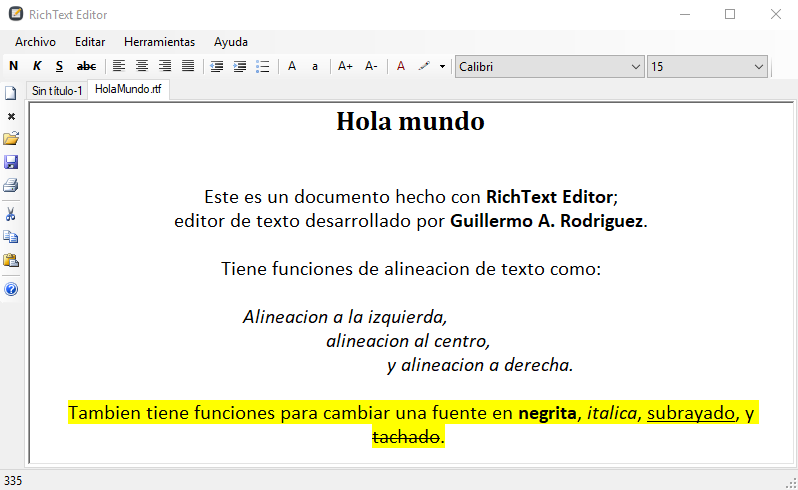

# RichText-Editor

RichText Editor es un proyecto de código abierto con licencia de MIT.

Un editor de texto enriquecido para Windows.

*RichText Editor imagen por [Guillermo A. Rodriguez][gar].*

[gar]: https://github.com/Abneed
